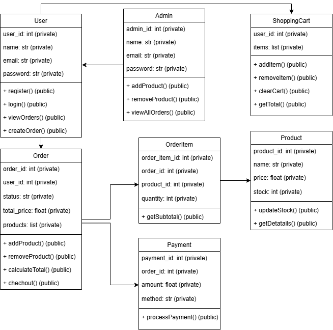
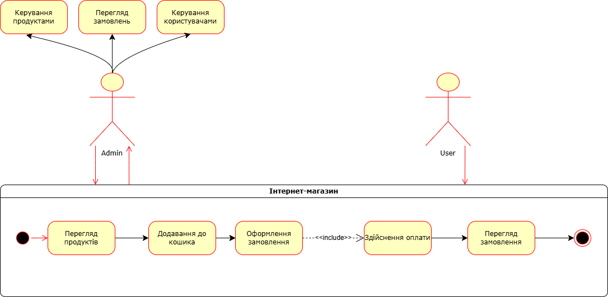

## UML-діаграми

### Діаграма класів

На діаграмі класів зображено основні сутності системи та їх взаємозв'язки:

- **User**: Представляє користувача системи з атрибутами ідентифікатора, імені, електронної пошти та паролю. 
- **Admin**: Розширює функціонал користувача з додатковими методами для управління продуктами та перегляду всіх замовлень.
- **ShoppingCart**: Кошик для зберігання товарів користувача.
- **Order**: Замовлення користувача з атрибутами статусу, загальної ціни та списку продуктів.
- **OrderItem**: Елемент замовлення, що зв'язує продукт із замовленням та містить інформацію про кількість товару.
- **Product**: Представляє товар з атрибутами ідентифікатора, назви, ціни та кількості на складі.
- **Payment**: Система платежів для обробки транзакцій, пов'язаних із замовленнями.

#### Зв'язки між класами
- **User і Admin**: 
    - *Тип зв’язку*: Успадкування 
    - Аdmin успадковує User через super().__init__() у методі __init__
- **User і ShoppingCart**:
    - *Тип зв’язку*: Агрегація 
    - Клас User має атрибут __cart типу ShoppingCart, який створюється під час ініціалізації користувача.
- **User і Order**:
    - *Тип зв’язку*: Асоціація 
    - Користувач створює замовлення через метод create_order(), але Order не є частиною User — це окремий об’єкт, пов’язаний через user_id.
- **Order і OrderItem**:
    - *Тип зв’язку*: Композиція 
    - Order містить список __products типу OrderItem. Ці об’єкти створюються та існують у контексті конкретного замовлення і не мають сенсу поза ним.
- **OrderItem і Product**:
    - *Тип зв’язку*: Асоціація 
    - OrderItem посилається на Product через product_id і зберігає об’єкт Product у __product. Однак Product існує незалежно від OrderItem.
- **Order і Payment**:
    - *Тип зв’язку*: Агрегація
    - Order створює об’єкт Payment під час виклику checkout(), але Payment може існувати як окремий запис у базі даних.
- **ShoppingCart і Product**:
    - *Тип зв’язку*: Асоціація  
    - ShoppingCart зберігає список __items, де кожен елемент посилається на product_id. Продукти додаються через add_item(), але самі об’єкти
- **Admin і Product**:
    - *Тип зв’язку*: Асоціація 
    - Admin має методи для додавання (add_product()) та видалення (remove_product()) продуктів, але не володіє ними напряму — це управління через базу даних.
- **Database та інші класи**:
    - *Тип зв’язку*: Асоціація 
    - Усі класи (User, Order, Product, тощо) використовують об’єкт db типу Database для збереження та завантаження даних у MongoDB.

### Діаграма випадків використання

На діаграмі випадків використання зображено основні сценарії взаємодії акторів із системою:

- **Користувач (User)** може:
  - Переглядати продукти
  - Додавати товари до кошика
  - Оформлювати замовлення
  - Здійснювати оплату
  - Переглядати своє замовлення

- **Адміністратор (Admin)** може:
  - Керувати продуктами (додавати, редагувати, видаляти)
  - Переглядати замовлення користувачів
  - Керувати користувачами

## Впровадження системних класів

1. **Переведення діаграм у код**:
   - Створено класи відповідно до діаграми класів
   - Реалізовано атрибути та методи для кожного класу
   - Встановлено взаємозв'язки між класами через атрибути та методи

2. **Основні методи**:
   - Для класу User:
     - `register()` - реєстрація нового користувача
     - `login()` - вхід у систему
     - `viewOrders()` - перегляд замовлень
     - `createOrder()` - створення нового замовлення
   - Для класу Admin:
     - `addProduct()` - додавання нового продукту
     - `removeProduct()` - видалення продукту
     - `viewAllOrders()` - перегляд усіх замовлень
   - Для класу ShoppingCart:
     - `addItem()` - додавання товару до кошика
     - `removeItem()` - видалення товару з кошика
     - `clearCart()` - очищення кошика
     - `getTotal()` - отримання загальної суми кошика
   - Для класу Order:
     - `addProduct()` - додавання продукту до замовлення
     - `removeProduct()` - видалення продукту з замовлення
     - `calculateTotal()` - обчислення загальної суми замовлення
     - `checkout()` - оформлення замовлення
   - Для класу Product:
     - `updateStock()` - оновлення кількості товару на складі
     - `getDetails()` - отримання детальної інформації про товар
   - Для класу Payment:
     - `processPayment()` - обробка платежу

### Написання модульних тестів

1. **Методи тестування класів**:
   - Написано більше 10 модульних тестів для перевірки функціоналу класів, що охоплюють:
     - Клас User:
       - `test_register_success` - перевірка успішної реєстрації користувача
       - `test_register_existing_email` - перевірка реєстрації з існуючою електронною поштою
       - `test_login_success` - перевірка успішного входу в систему
       - `test_login_invalid_password` - перевірка входу з невірним паролем
       - `test_login_invalid_email` - перевірка входу з невірною електронною поштою
     - Клас Product:
       - `test_update_stock` - перевірка оновлення кількості товару
       - `test_update_stock_negative` - перевірка оновлення кількості товару з від'ємним значенням
       - `test_get_details` - перевірка отримання деталей товару
     - Клас Order:
       - `test_add_product` - перевірка додавання товару до замовлення
       - `test_remove_product` - перевірка видалення товару із замовлення
       - `test_checkout_empty_order` - перевірка оформлення порожнього замовлення
     - Клас Admin:
       - `test_add_product` - перевірка додавання товару адміністратором
       - `test_remove_product` - перевірка видалення товару адміністратором
       - `test_remove_nonexistent_product` - перевірка видалення неіснуючого товару

2. **Тестування взаємодії між об'єктами**:
   - Реалізовано інтеграційний тест `test_user_places_order`, який перевіряє повний цикл замовлення:
     - Реєстрація користувача
     - Додавання товарів до кошика
     - Обчислення загальної суми кошика
     - Створення замовлення
     - Оформлення замовлення з оплатою
     - Перевірка історії замовлень користувача
     - Перевірка оновлення кількості товарів на складі після замовлення
   
   - Всі тести використовують підключення до бази даних MongoDB для перевірки:
     - Зберігання даних
     - Оновлення даних
     - Видалення даних
   
   - Перед кожним тестом виконується очищення бази даних, щоб забезпечити ізольованість тестів
